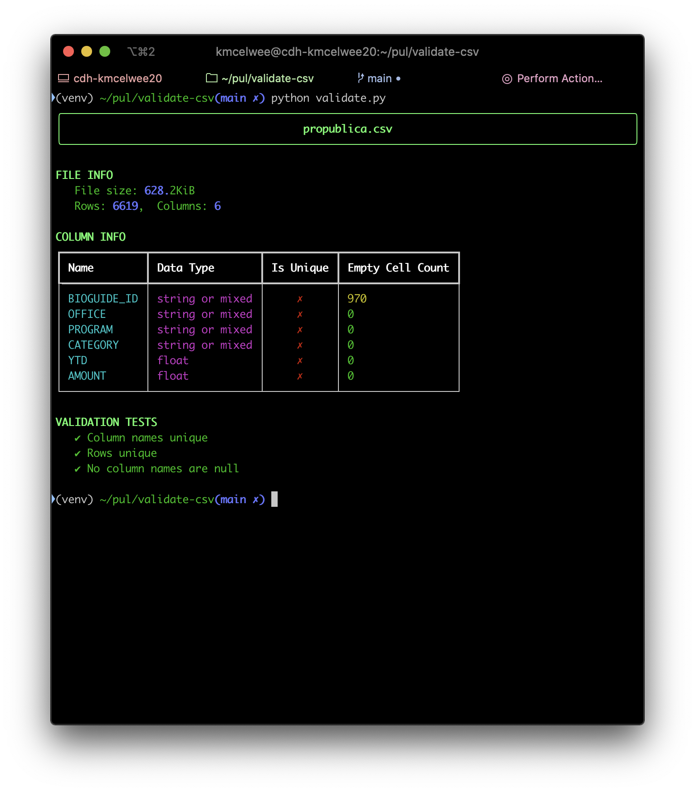

# CSV Validator

(Python 3.7)

A simple collection of CSV/TSV tests for the Princeton Research Data Service to run on Research Computing clusters before migrating data to the library's data repository infrastructure, providing a report summary of general tabular information and validating the schema requirements of [RFC 4180](https://www.loc.gov/preservation/digital/formats/fdd/fdd000323.shtml).



## Setup

```bash
# clone this repo to your Tigress account
git clone URL
# ensure you have python 3.7 installed
python --version
> Python 3.7.6
# Create a virtual environment and activate it
python -m venv venv
source venv/bin/activate
# install all dependencies
pip install -r requirements.txt
# run tests to ensure that the setup ran properly
python test.py
```